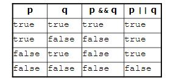
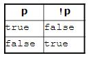
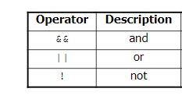

## Reading

zyBooks Ch 3 Branches 3.1 - 3.10

## Reference
[Oracle's Java Reference](https://docs.oracle.com/javase/tutorial/index.html)

## Practice

zyBooks Ch 3 Practice 3.1 - 3.10 (graded participation activity)

## Learning Outcomes
Upon successful completion of the work, students will be familiar with and able to apply the below concepts and techniques in their programs

* If - else if - else branches
* Equality and relational operators
* Detecting ranges 
* Logical operators

## Notes

The *if* statement executes a block of statements only if a test is true. 

The *if - else* statement executes one black if test is true, another if test is false.

The *if - else if...else if - else* statment executes one of multiple outcomes, the one for which the test is true.

Some examples of when to use which statement:
* Student has an Associate, Bachelor or Master's degree. Use *if - else if - else* statement.
* Student made the deans list or the honor roll. Use *if - else if* statement
* Is a number divisible by 5, 7, and 12. Use multiple *if* statements. *if - if - if*
* Calculate a letter GPA based on a numeric GPA. Use *if - else if...else if...else if...-else*

## Truth tables and Logical Operators 

## Example
Guessing game with Random class random number generator and use of conditional statements.
code [here](https://github.com/ava11235/it211/blob/master/GuessingGame.java)
